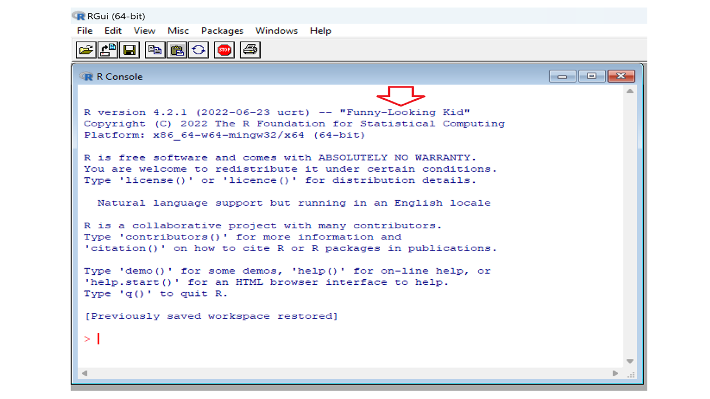
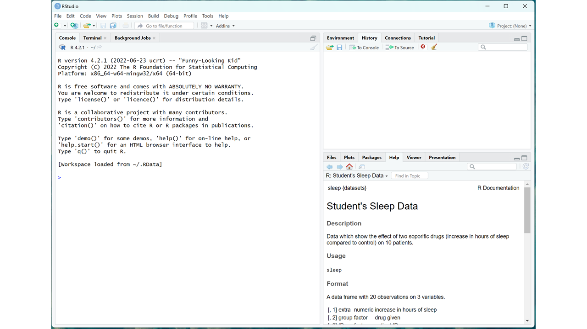
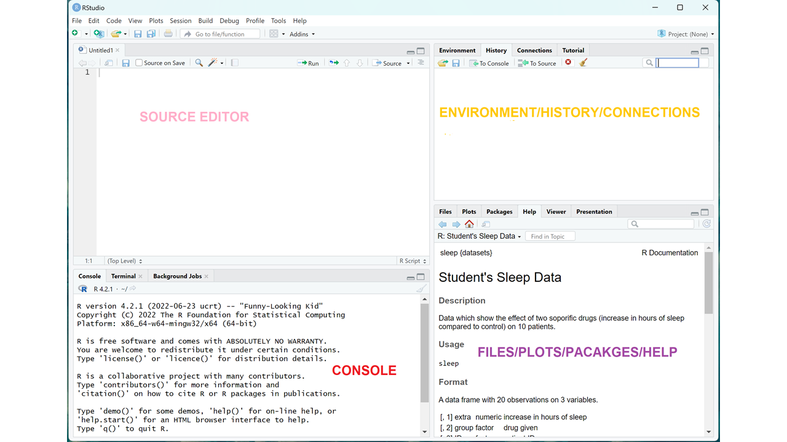

# Getting started in R (Installations and tutorials)

## Introduction

Data analysis is a set of skills that is a must in any industry or profession, so you have done well taking this course. Congratulations! Some of the industries that frequently require the services of data analysts include:

- Finance: Data analysts help financial organizations make informed decisions by analyzing large amounts of data related to investments, financial markets, and other financial products.
-	Healthcare: Data analysts play a crucial role in analyzing patient data to improve patient outcomes, reduce costs, and support research and development efforts.
-	Retail: Retail companies use data analysts to understand consumer behavior and preferences, improve supply chain management, and increase sales and profits.
-	Technology: Data analysts are essential in the technology industry, where they help organizations make decisions about product development, marketing, and other important business initiatives.
-	Manufacturing: Data analysts in the manufacturing industry help companies improve processes, reduce costs, and increase efficiency.
-	Government: Government agencies use data analysts to analyze data related to public health, safety, and security, as well as to make informed policy decisions.
-	Transportation: Data analysts in the transportation industry help companies optimize routes, reduce costs, and improve safety.
-	Marketing and Advertising: Data analysts are key players in the marketing and advertising industry, where they help companies understand consumer behavior and preferences, and develop effective marketing campaigns.

This list is not exhaustive and data analysis skills are needed in many other industries and organizations as well. The importance of data analysis continues to grow in today's data-driven world, and the demand for skilled data analysts is expected to continue to increase in the coming years. There are many different aspects to data analysis, such as collecting and cleaning data, visualizing data, and building models to make predictions. This book takes you though all these different aspects of data analysis and ends with an introduction to building machine learning models. All the data analysis in this book will be done in R. 

## What is R?

R is a programming language and software environment for statistical computing and graphics. It is widely used for data analysis and statistical modeling in a variety of fields, including finance, medicine, and social sciences. R has many features that make it well-suited for data analysis, such as a large collection of built-in functions for data manipulation and visualization, the ability to handle large and complex data sets, and a wide range of libraries and packages for specific tasks, such as machine learning, text mining, and spatial analysis. It also has a strong interactive environment, which allows for quick prototyping and exploration of data.
 R is open-source software, which means that it is free to use and distribute and that the source code is available for users to modify and improve. It has a large community of users and developers who contribute to its development and share their work in the form of libraries and packages. This means that R will always be able to perform the newest statistical analyses as soon as anyone thinks of them, fix its bugs quickly and transparently. It also brings together a community of programming and statistics nerds also known as useRs, that one can turn to for help. R is a good option if one is doing something sophisticated because of its flexibility, unlike point-and-click program programs. R is the most powerful data visualization tool known to date. Other traditional software like EViews can work with R data and send R commands to execute. R is increasingly being used as an industry standard in the realm of data analytics, also known as data science. Many companies (e.g., Facebook, Merck, Pfizer) recruit candidates who have a solid grasp of both statistics and programming hence learning R will make you more attractive in the job market. 
 
*It is easy to get frustrated and discouraged when it comes to programming but if you are patient, you will come to appreciate the unequal power of R when it comes to data analysis and visualization.*

Like in other programming languages, you can save your work as scripts that can be easily executed at any moment. These scripts serve as a record of the analysis you performed, a key feature that facilitates reproducible work. One of its major strengths is visualization.

## Downloading and Installing R

To use R we need to download R and RStudio. These are two separate software. RStudio will be our launching pad for data science projects and you will realize later on that it provides a lot of other tools that will help use in crease our efficiency. Search R using the Google search engine or any other search engine of your choice. R is available for MAC, Windows, or any other operating system like Linux. Alternatively follow the instructions below:

To Install R:
Open an internet browser and go to www.r-project.org. Find R for your operating system, download and save the executable file anywhere in your PC. Run the .exe file and follow instructions as you install.

To Install RStudio:
Go to www.rstudio.com and click on the "Download RStudio" button. Click on "Download RStudio Desktop," click on the version recommended for your system, or the latest Windows version, and save the executable file.  Run the .exe file and follow the installation instructions.  

**Note:** Before we continue, I want you to take note of this, we are never going to be using the R console directly, all our work will be done in R studio. If you double-click R the console will look something like this:

<h1 style="text-align:center;">The Console</h1>
<p align="center">
  
</p>


At the time of writing the name of this version was “Funny-Looking Kid” as shown above. You can execute commands directly in this console, but we are not going to do that. Close the console and open RStudio. We will be using the interactive integrated development environment (IDE) RStudio.

Once you open RStudio you will see something like this:

<h1 style="text-align:center;">RStudio Screen</h1>
<p align="center">
  
</p>

To start a new script, you can click on File, the New File, then R Script. I use windows and I usually just use the short-cut ctr+Shift+N. These gives you the four panels of RStudio. Once you have a new script, a typical RStudio screen looks like the one below:

<h1 style="text-align:center;">RStudio Panels</h1>
<p align="center">
  
</p>


The panels or windows that make up the RStudio interface are:

- The Source Editor: This is the main window in RStudio where you can write, edit, and save R scripts and R Markdown files.
- The Console: This is where you can interact with the R environment, enter commands, and see the results of your commands.
- The Environment/History/Connections Panel: This panel displays information about the current R environment, including the objects in your workspace, the history of your R commands, and the connections to any databases or other resources.
- The Files/Plots/Packages/Help Panel: This panel provides access to your project files and directories, the plots and graphs you create, the packages you have installed, and the help documentation for R functions and packages.
These four quadrants are designed to work together to provide a comprehensive and user-friendly environment for working with R.

R comes a couple of data sets to get you started. You will see in the bottom right quadrant it explains student's sleep data. To see all these data sets in r-base you can type this in the source editor:

```{r setup}
data()
```

The data set in opened in another file and if you want a particular dataset to be explained you use the following code.

```{r Eudata}
?EuStockMarkets
```

This explains the nature of the Euro Stock Markets data in the fourth quadrant. 

## Getting Started in R and R Packages

To save you script use file, save as and choose a name. Call it fist_file, use a n underscore to separate the words

<h1 style="text-align:center;">Save Script</h1>
<p align="center">
  
</p>

To save object in R we use the less than sign (<) followed by a minus (-) like this <-, and this is know as an assignment operator in R. We are going to use this for a quaratic equation. Suppose you have the quadratic equation: $$ 3y^2 + 4y - 2 = 0$$
You will recall that to use the quadratic equation:
$$ y = \frac{-b \pm \sqrt{b^2 - 4ac}}{2a} $$

$$ a = 3, \quad b = 4 \quad \& \quad c = -2 $$
Let's put these in RStudio using our script. Use the code below:

```{r quaratic}
a <- 3
b <- 4
c <- -2

y_1 <- (-b + sqrt(b^2 - 4*a*c))/(2*a)
y_2 <- (-b - sqrt(b^2 - 4*a*c))/(2*a)

y_1; y_2
```
You should get 0.39 and -1,72 as your answers. I hope you found this exercise interesting. Try a couple of quadratic equations yourself and see if you get the answers right.  

As mentioned earlier, R is open sources and so many users make packages to make it easier to use


