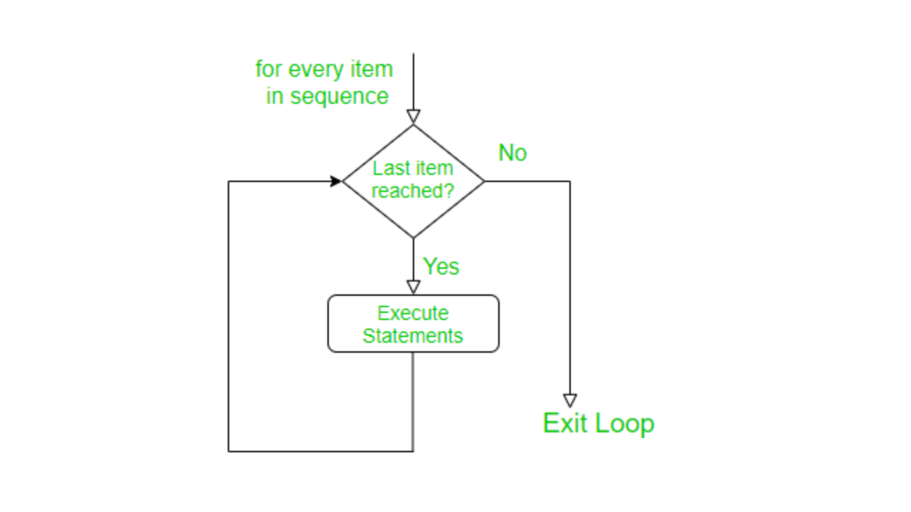

# R Basics and Simulations

## Packages in R

Packages in R are collections of functions, data, and documentation that extend the functionality of base R. They provide additional functionality, such as statistical models, data manipulation and visualization tools, machine learning algorithms, and more. Packages are created by members of the R community and are made available for others to use as mentioned in the previous chapter. To use a package in R, you need to install it on your computer and then load it into your current R session. This can be done using the install.packages() function, followed by the library() or require() function. The library and require functions in R are used to load packages into the current R session. They both have the same basic function, but there are some differences in their behavior. The library function will throw an error if the package you are trying to load is not installed on your computer. The require function, on the other hand, will not throw an error if the package you are trying to load is not installed. Instead, it will return FALSE if the package is not installed, and TRUE if the package is successfully loaded. Therefore, the main difference between library and require is that library will throw an error if the package you are trying to load is not installed, while require will not throw an error, but instead return FALSE if the package is not installed. In general, the library function is more commonly used, as it provides a clear error message if the required package is not installed.

One package I always load whenever I get into RStudio is tidyverse. The tidyverse is a collection of packages in R that are designed for data science and data analysis. The package is built around the concept of "tidy data," which refers to a specific structure for data where each variable is in a separate column, each observation is in a separate row, and each type of observational unit is in a separate table. The tidyverse packages are designed to make it easy to work with data in this structure, and they provide a variety of tools for data manipulation, visualization, and modeling.
The tidyverse package itself is a meta-package that provides a convenient way to install and load multiple packages in the tidyverse ecosystem. When you install the tidyverse package, you will also install several other packages, including:

- ggplot2: a popular data visualization package
- dplyr: a fast and efficient data manipulation package
- tidyr: a package for cleaning and transforming data into a tidy format
- readr: a fast and efficient data import package
- purrr: a functional programming package for R
- stringr: a package for working with strings
- lubridate: a package for working with dates and times

By installing the tidyverse package, you will have access to a wide range of tools for working with data in R, and you can easily load all these packages into your R session with a single command. The tidyverse packages are widely used in the R community and are well-documented, so it is easy to find help and resources online if you need it.
Use the code below to install the tidyverse package:

```{r tidyverse}
#install.packages("tidyverse")
```
Remove the # signto run the code. The # sign is used to write comments in R. 

## LOOPS

A loop is a repeating set of instructions in a computer program that allows you to automate tasks. The loop will keep running until a specific condition is met. The purpose of loops is to perform a set of operations multiple times, either a specified number of times or until a certain condition is met.
For example, imagine you need to print the numbers 1 to 10. Instead of writing out each number, you can use a loop to automate the task. The loop will keep running 10 times, printing each number until it reaches 10.
In simple terms, a loop is like a machine that can perform the same task repeatedly, until you tell it to stop. This can save you a lot of time and effort, especially when working with large amounts of data. Loops are important in data analysis because they allow you to automate repetitive tasks, which can save time and reduce the risk of errors. In data analysis, it is often necessary to perform the same operation on multiple sets of data, such as summarizing data or transforming data into a different format. Loops allow you to perform these operations in an efficient and systematic manner.
For example, imagine you have a large dataset with 100 variables, and you need to calculate the mean and standard deviation of each variable. Instead of manually calculating these statistics for each variable, you can use a loop to automate the process. This will not only save time but also reduce the risk of errors, since it eliminates the need for manual calculation.
In addition to automating repetitive tasks, loops can also help you write code that is more readable and maintainable. By using a loop, you can encapsulate a set of operations in a single block of code, making it easier to understand what the code is doing and reducing the need for repetitive code.
Overall, loops are an essential tool in data analysis, allowing you to automate repetitive tasks, reduce errors, and write more readable and maintainable code.

### For Loops

In R, a for loop is used to repeat a set of statements multiple times. The basic structure of a for loop is given by: 

<h1 style="text-align:center;">For Loop Structure</h1>
<p align="center">
  
</p>

source: https://www.geeksforgeeks.org/for-loop-in-r/

The basic syntax of a for loop in R is as follows:

```{r forloop}
#for (variable in sequence) {
#  statements
# }
```

Where:

variable is a variable that will be used to keep track of the current iteration of the loop.
sequence is a vector or other data structure that defines the values that variable will take on during each iteration of the loop.
statements are the R statements that will be executed during each iteration of the loop.
Here is a simple example of a for loop in R:

```{r forl}
for (i in 1:5) {
  print(i)
}

```

This code will print the numbers 1 through 5. On the first iteration of the loop, i will be 1, on the second iteration i will be 2, and so on, until the loop has completed 5 iterations and i has taken on the value 5.

Note that in R, for loops are generally not as efficient as other types of loops, and they can be difficult to read and debug. In many cases, it is recommended to use alternative constructs such as sapply or lapply instead. However, in some cases, a for loop can still be a useful tool for solving problems in R.


### While Loops


## Simulations

We will get to the use of data, but it is important to note that you can do simulations without any data.

