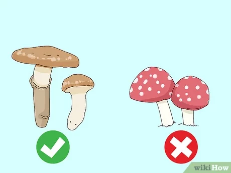

# Machine Learning Basics

  <strong>What is learning?:</strong> 
  Learning is the process of acquiring knowledge, skills, behaviors, or attitudes through experience, study, or instruction.

  

Learning involves a change in knowledge, understanding, or behavior resulting from exposure to new information, experiences, or feedback. Learning can occur through a variety of mechanisms, including observation, experience, and instruction. It is a complex and dynamic process that involves cognitive, social, and emotional factors. Additionally, learning can take place consciously or unconsciously, and it can be intentional or unintentional. This is where it get's interesting, machines can learn too, &#x1F60A; which is the agenda for this topic. 

<h5> Kinds of Learning </h5> 

> How do we communicate patterns of desired behavior? We can teach:
>
> - by instruction: “to tell whether a mushroom is poisonous, first look at its gills...”
> - by example: “here are six poisonous fungi; here, six safe ones. see a pattern?”
> - by reinforcement: “eat foraged mushrooms for a month; learn from getting sick.”

Consider the picture from wikihow.com below of poisonous mushrooms vs edible mushrooms:

<h5 style="text-align:center;">Poisonous Vs Edible Mushrooms</h5>

  

 source: wikihow.com/Identify-Edible-Mushrooms#/ 

Machine learning is the art of programming computers to learn from such sources and in this case, it would involve teaching a machine learning algorithm to recognize the patterns of successfully identifying poisonous and edible mushrooms. We’ll focus on the most important case: learning from examples. 

From the figure above, predicting weather mushrooms are poisonous or not, our learning program selects from a class of hypotheses (brown blob) a plausible hypothesis that well fits (no dots) a given list of poison-labeled mushrooms (pink blob with white dots). Evaluating the selected hypothesis on new mushrooms, we predict the corresponding poison levels. Selecting a hypothesis is called learning; predicting unseen poison levels, inference. The examples we learn from are training data; the new mushrooms and their true poison levels are testing data.

Here is another example:

> How do we communicate the patterns of desired behavior for baking bread? We can teach:
>
> - by instruction: "to make bread, you need flour, yeast, salt, and water. Mix them together and knead the dough for 10 minutes."
> - by example: "here are six loaves of perfect bread; here, six loaves of burnt bread. see a pattern?"
> - by reinforcement: "bake bread every day for a month; learn from the texture, color, and taste of each loaf."

**Food for thought❓**

Have you ever stopped to think about how you learn best? 
Do you prefer to be taught step-by-step instructions, or do you learn better by seeing examples? 
Or maybe you're a hands-on learner who needs reinforcement to really internalize a lesson?

Think back to something you've learned recently, and ask yourself: did you learn it by instruction, by example, or by reinforcement? Understanding your own learning style can help you become a more effective learner and teacher, and can even improve your communication skills. So take a moment to reflect on your own learning experiences, and see what you can learn from them. You might be surprised at what you discover!

Statistical approaches and machine learning techniques are both ways of understanding a process by analyzing observations, but they have different assumptions and methods. Statistical approaches use strict rules and models to explain observations, while machine learning is more flexible and uses large amounts of data to find patterns and make predictions without human input. Machine learning is particularly useful for complex problems with many variables or non-linear systems. This chapter introduces machine learning methodologies but does not get into too much detail. 

## Introduction to Machine Learning

There are three types of machine learning: supervised learning, unsupervised learning, and deep learning/reinforcement learning.

### Some Packages

### Supervised Learning

Supervised learning is a type of machine learning technique where the algorithm learns to predict an output value based on input data, while being trained on labeled examples. In supervised learning, the algorithm is provided with a labeled dataset, which means that each example in the dataset is paired with the correct output value. The algorithm then learns to map the input to the output by adjusting its parameters, with the goal of minimizing the difference between the predicted output and the correct output for each labeled example. Once the algorithm has learned from the labeled dataset, it can make predictions on new, unlabeled data by applying the learned mapping function. Examples of supervised learning include predicting housing prices based on features such as location, size, and number of rooms, or classifying emails as spam or not spam based on their content.

Supervised learning is a type of machine learning where the algorithm is trained on a labeled dataset. This means that the input data (X) is already matched with the output data (Y). The algorithm learns to find patterns between X and Y, which it can then use to predict Y values for new X values that it has not seen before. The labeled dataset is used to train the algorithm, which means it learns to identify the relationships between X and Y.

In supervised learning, the Y variable is the target variable, and the X variables are called features. The ML algorithm learns to predict the target variable based on the features. For example, in a credit card fraud detection scenario, the target variable is whether the transaction is fraudulent or not (binary), and the features are transaction characteristics like amount, location, and time. The algorithm learns to predict whether a transaction is fraudulent based on these features.

Supervised learning can be divided into two categories: regression and classification. In regression problems, the target variable is continuous, and the goal is to predict a numerical value. In classification problems, the target variable is categorical, and the goal is to sort observations into different categories. For example, in credit rating, the target variable is ordinal (ranking from low to high creditworthiness), and the goal is to predict the credit rating category based on the features.

Regression and classification use different ML techniques, and there are many different algorithms available. Logistic regression is an example of a classification algorithm, and ordinary least squares is an example of a regression algorithm. Non-linear models can also be used for problems involving large datasets with many features.

The success of supervised learning algorithms is evaluated using test data, where the predicted values are compared to the actual values. If the algorithm can predict the values accurately for new data, it is considered to have learned from the labeled dataset.

<strong>Example 12.1:</strong>

<ol>
<li>Calculate the sum of 5 and 7.</li>
<li>Create a vector of the numbers 1 to 10.</li>
<li>Plot the sine function from 0 to 2π.</li>
</ol>

### Unsupervised Learning

Unsupervised learning is a type of machine learning that involves finding patterns in a dataset without prior knowledge of the correct output or labeled data. Unlike supervised learning, there is no predetermined target variable or correct answer to work towards. Instead, unsupervised learning algorithms identify similarities and relationships between data points and group them together based on these similarities.

One common unsupervised learning technique is clustering, where data points are partitioned into groups based on their similarities or distances from each other. Another technique is dimensionality reduction, which aims to reduce the number of variables or features in the dataset while retaining the most relevant information.

In unsupervised learning, the emphasis is on finding hidden structures or patterns within the data that can be used for further analysis or decision-making. For example, unsupervised learning can be used to segment customers based on their purchasing behavior or to identify anomalies or outliers in financial transactions.

<strong>Example 12.2:</strong>

<ol>
<li>Calculate the sum of 5 and 7.</li>
<li>Create a vector of the numbers 1 to 10.</li>
<li>Plot the sine function from 0 to 2π.</li>
</ol>

### Deep Learning and Reinforcement Learning

<strong>Example 12.3:</strong>

<ol>
<li>Calculate the sum of 5 and 7.</li>
<li>Create a vector of the numbers 1 to 10.</li>
<li>Plot the sine function from 0 to 2π.</li>
</ol>

## Cross Validation

## Machine Learning Algorithms

### Supervised Machine Learning Algorithms

#### Penalised Regression

##### Regularization

#### Support Vector Machine

#### K-Nearest Neighbour

#### Classification and Regresion Trees (CART)

#### Ensemble

##### Random forest

### Supervised Machine Learning Algorithms

#### Dimension Reduction

##### Principal Components Analysis (PCA)

Scree Plot

#### Clustering

##### K-Means Clustering

##### Hierarchical Clustering

Agglomerative clustering and divisive clustering are two popular approaches to hierarchical clustering, which is a type of unsupervised machine learning used for grouping similar data points together.

Agglomerative clustering, also known as bottom-up clustering, starts with each data point as a separate cluster and then iteratively merges the closest pairs of clusters until all data points belong to a single cluster. This process results in a dendrogram, which is a tree-like structure that shows how the clusters are formed. Agglomerative clustering is computationally efficient and can handle a large number of data points. It is also relatively easy to interpret and visualize the results.

Divisive clustering, also known as top-down clustering, takes the opposite approach. It starts with all data points belonging to a single cluster and then recursively splits the clusters into smaller clusters until each data point belongs to its own cluster. This process also results in a dendrogram, but it can be computationally expensive, especially when dealing with large datasets. Divisive clustering can be more difficult to interpret and visualize than agglomerative clustering, but it can be more effective in identifying clusters that are well-separated.

In summary, agglomerative clustering and divisive clustering are two approaches to hierarchical clustering that differ in the way they group similar data points together. Agglomerative clustering is a bottom-up approach that iteratively merges the closest pairs of clusters, while divisive clustering is a top-down approach that recursively splits the clusters into smaller clusters.

## Deep Learning

### Artificial Neural Networks (ANN)

### Deep Learning Nets (DLN)

### Reinforcement Learning

In 2016, DeepMind, a subsidiary of Alphabet Inc., achieved a major breakthrough in artificial intelligence (AI) by creating a computer program named AlphaGo, which defeated the world champion in the ancient Chinese board game Go. This was a significant accomplishment because Go is considered to be one of the most challenging games for AI due to its vast number of possible moves.

Reinforcement learning was one of the primary methods used by AlphaGo to learn how to play the game at an expert level. Reinforcement learning is a subfield of machine learning that involves an agent learning how to make decisions in an environment by receiving feedback in the form of rewards or penalties. In the case of AlphaGo, the environment was the Go board, and the rewards were points earned for winning the game.

The development of AlphaGo consisted of two main stages: training and playing. During the training stage, the program used a combination of supervised learning and reinforcement learning to learn the basic rules and strategies of the game. It was fed a massive dataset of expert-level games to learn from, and its neural networks were trained to predict the next best move given a particular board state.

In the playing stage, AlphaGo used reinforcement learning to improve its gameplay further. It was pitted against itself in numerous games and received rewards for winning and penalties for losing. The program's neural networks learned from each game, adapting and evolving to improve its gameplay. Through this process, AlphaGo gradually became more skilled and capable of beating even the world's best Go players.

One of the key innovations that enabled AlphaGo's success was the use of a technique called Monte Carlo tree search. This algorithm enabled AlphaGo to explore a vast number of possible moves and board states, allowing it to make more informed decisions and ultimately defeat human players.

In conclusion, reinforcement learning played a critical role in enabling AlphaGo to beat the world champion in Go. By training on expert-level games and receiving rewards for winning and penalties for losing, AlphaGo's neural networks learned to play the game at an expert level. This is a significant achievement in the field of AI and demonstrates the potential of reinforcement learning in solving complex problems.

## Dealing With Large Datasets

R can be used for Big Data analysis, but it requires special techniques and tools to handle large datasets. R is an open-source programming language that is widely used for statistical computing and graphics. However, it was not originally designed for Big Data analysis, and its memory limitations can make it challenging to work with large datasets that do not fit into the memory of a single machine.

To overcome these limitations, several tools and packages have been developed to allow R to work with Big Data. Some of these tools and packages include:

Distributed computing frameworks: R can be integrated with distributed computing frameworks like Apache Hadoop and Apache Spark to handle large datasets that are distributed across multiple machines.

Parallel computing: R provides several packages that support parallel computing, such as parallel, snow, and foreach, which can help speed up computations on large datasets.

Memory-efficient data structures: R also provides packages such as data.table and dplyr that allow for efficient manipulation of large datasets in memory.

Database connectivity: R can connect to various databases, such as MySQL, Oracle, and PostgreSQL, to work with large datasets stored in a database.

Cloud-based solutions: Cloud-based solutions, such as Amazon Web Services (AWS) and Microsoft Azure, offer Big Data services that integrate with R, allowing for large-scale data analysis and processing.

In summary, R can be used for Big Data analysis, but it requires additional tools and techniques to handle large datasets efficiently.

## Evaluating Model Performance

